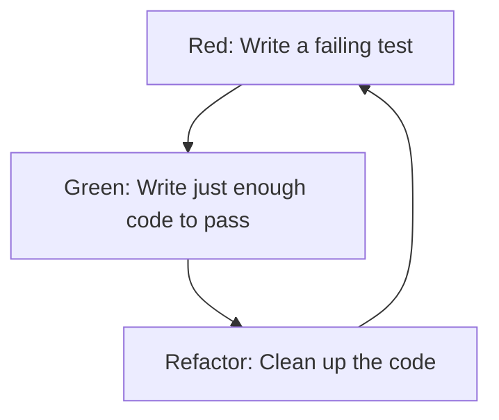

# RSpec: Test-Driven Development (TDD): Red, Green, Refactor, Repeat

If you’ve ever wanted to feel like a code wizard—summoning features out of thin air and banishing bugs before they appear—TDD is your magic spellbook. In this lesson, we’ll break down Test-Driven Development (TDD) into bite-sized steps, and show you how RSpec makes it all possible.

---

## What is Test-Driven Development (TDD)?

TDD is a way of writing code where you write your tests first, then write just enough code to make those tests pass. It’s like writing the rules to a game before you start playing—no cheating allowed!

The TDD cycle is famously known as:

1. **Red**: Write a failing test (it should fail, or you’re doing it wrong!)
2. **Green**: Write the minimum code needed to make the test pass
3. **Refactor**: Clean up your code, making it prettier and more efficient, while keeping all tests green

Then you repeat. And repeat. And repeat. (It’s like shampoo instructions, but for code.)

## Why Bother With TDD?

- **Confidence**: You know your code works, because you proved it to yourself.
- **Focus**: You only write the code you need—no more, no less.
- **Safety Net**: Refactoring is less scary when you have tests watching your back.
- **Documentation**: Your tests describe what your code is supposed to do, for you and for future developers (including Future You).

---

## Visual Guide: The Red-Green-Refactor Cycle

Here's a flow diagram showing the TDD cycle, with code snippets for each step:



**Red:**

```ruby
# /spec/movie_spec.rb
it "has a title" do
  expect(Movie.new("Inception", 148).title).to eq("Inception")
end
# (Fails: undefined method `title`)
```

**Green:**

```ruby
# /lib/movie.rb
class Movie
  def initialize(title, duration)
    @title = title
  end

  def title
    @title
  end
end
# (Test passes for title, but not for duration)
```

**Refactor:**

```ruby
# /lib/movie.rb
class Movie
  attr_reader :title, :duration
  def initialize(title, duration)
    @title = title
    @duration = duration
  end
end
# (Now all tests pass, and code is clean)
```

Repeat this cycle for every new feature or behavior!

Let's say you want to write a method that doubles a number. Here's how you'd do it, TDD-style. **You'll need to create these files yourself** - they don't exist yet! For each code example, check the comment at the top to see which file it belongs in!

## The Red-Green-Refactor Cycle In Depth

### Step 1: Red (Write a Failing Test)

First, create the test file:

```ruby
# /spec/double_spec.rb
require_relative '../double' # Make sure to require the file with your method!

RSpec.describe "#double_number" do
  it "returns twice the input number" do
    expect(double_number(2)).to eq(4)
  end
end
```

If you run this test now, it will fail. That's good! You haven't written the `double_number` method yet.

**Sample Failing Output:**

```shell
Failures:

  1) #double_number returns twice the input number
     Failure/Error: expect(double_number(2)).to eq(4)

     NameError:
       undefined local variable or method `double_number' for #<RSpec::ExampleGroups::DoubleNumber:0x00007f...>
     # ./spec/double_spec.rb:4:in `block (2 levels) in <top (required)>'

Finished in 0.01 seconds (files took 0.1 seconds to load)
1 example, 1 failure
```

### Step 2: Green (Write the Simplest Code to Pass)

```ruby
# /double.rb
def double_number(n)
  4 # This is cheating, but it passes the test!
end
```

But wait! That only works for 2. Let’s add another test:

```ruby
# /spec/double_spec.rb
it "works for other numbers too" do
  expect(double_number(5)).to eq(10)
end
```

Now your code needs to be smarter:

```ruby
# /double.rb
def double_number(n)
  n * 2
end
```

### Step 3: Refactor (Clean Up)

In this case, our code is already pretty clean. But if you had extra logic, comments, or duplication, now’s the time to tidy up. For example, you might rename a variable, remove an unnecessary comment, or extract a helper method. The key: all tests must stay green!

```ruby
# /double.rb (after refactor)
def double_number(number)
  number * 2
end
```

## TDD: More Than Just a Buzzword

TDD isn’t just for fancy-pants developers or Silicon Valley startups. It’s for anyone who wants to:

- Catch bugs early (before your users do)
- Write code that’s easy to change
- Sleep better at night

---

## Extra TDD Tips

- Keep tests small and focused—one behavior per test.
- (Optional but good habit) Only one assertion per test.
- TDD works for methods, classes, and even Rails features—start small and build up!

---

## Common TDD Pitfalls (and How to Avoid Them)

- **Writing too much code before testing**: Remember, only write enough code to make the test pass!
- **Skipping the refactor step**: Don’t leave messy code behind. Clean as you go!
- **Making tests too broad**: Keep tests focused and specific. It’s easier to spot what’s broken.

## Getting Hands-On: Practicing TDD with Movies

Ready to practice? Here’s how to get started:

1. **Fork and clone this repo to your own GitHub account.**
2. **Install dependencies:**

   ```zsh
   bundle install
   ```

3. **Run the specs:**

   ```zsh
   bin/rspec
   ```

4. **Explore the code and specs:**

   - All lesson code uses the Movie and Screening domain (see `lib/` and `spec/`).
   - The spec file (`spec/movie_spec.rb`) is written to show the TDD process for each feature:
     - Each example starts with a failing test (Red), then you write just enough code to make it pass (Green), and finally refactor (Refactor).
     - You’ll see 10+ features, each developed in this TDD cycle.
   - The two specs marked as `pending` are for you to practice TDD:
     - For each, start by running the specs and seeing the pending message (Red).
     - Write the minimum code in `lib/movie.rb` to make the spec pass (Green).
     - Refactor your code if needed (Refactor).

5. **Re-run the specs** to verify your changes!

**Challenge:** Try writing your own TDD cycle for a new Movie feature (e.g., "Movie#average_screening_time" or "Screening#cancel!").

---

## Resources

- [RSpec: Test-Driven Development](https://rspec.info/)
- [Test-Driven Development by Example (Kent Beck)](https://www.goodreads.com/book/show/387190.Test_Driven_Development)
- [Thoughtbot: TDD in Ruby](https://thoughtbot.com/upcase/test-driven-rails-resources)

_Next: You’ll learn about RSpec’s examples, expectations, and matchers—the building blocks of every great test!_
